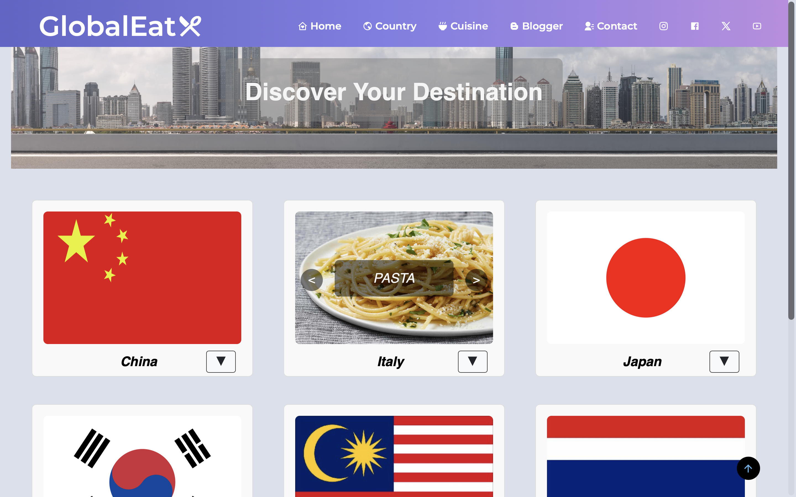
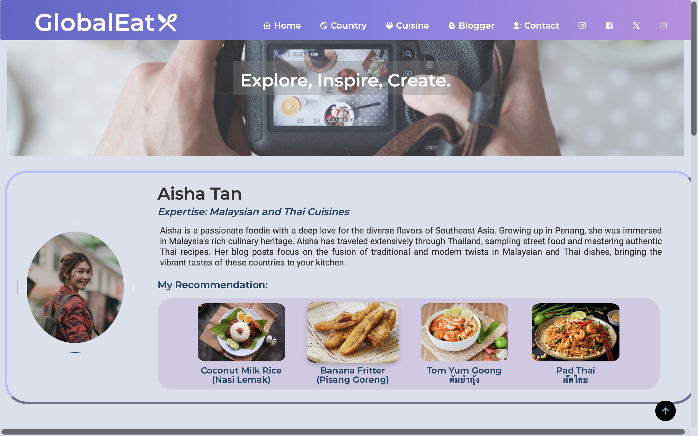
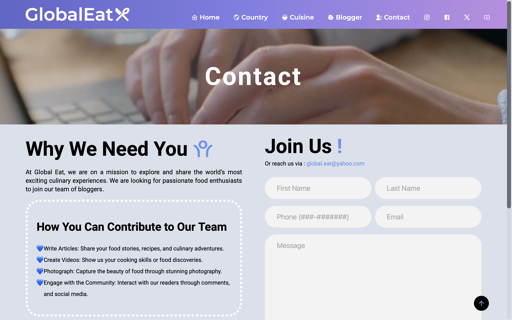

# Food Website (GlobalEat)

A small static multi-page website project containing content pages for cuisine, country information, a blog, contact page, and shared header/footer components. Built with plain HTML, CSS and a little JavaScript.

## Project Structure
- HOME/: main landing page (index.html, styles and scripts)
- CUISINE/: various cuisine pages and styles
- COUNTRY/: country page with styles and script
- CONTACT US/: contact page with CSS and JS
- HeaderAndFooter/: shared header and footer assets
- IMAGES/: project images
- BLOGGER/: blog page and styles

## Quick Preview
- Website link: to be updated

### Home Page

### Country Page

### Cuisine Page

### Blogger Page

### Contact Page

